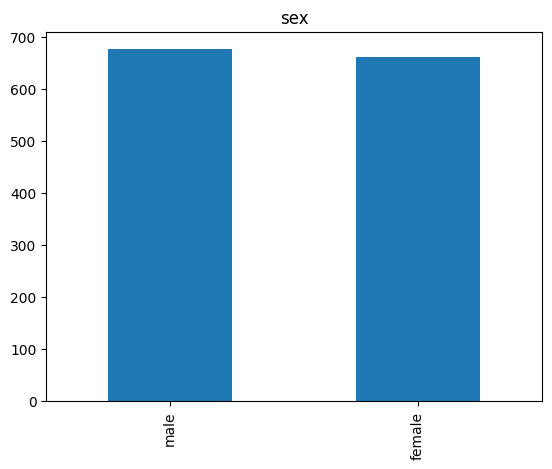

# Laporan Proyek Machine Learning - Bryant S Aritonang

## Domain Proyek

---

### Latar Belakang

Asuransi kesehatan telah menjadi bagian integral dari sistem perawatan kesehatan di seluruh dunia, termasuk di Amerika Serikat. Konsep dasar asuransi kesehatan adalah kontrak antara individu dan perusahaan asuransi yang memastikan perlindungan finansial terhadap biaya perawatan kesehatan yang mungkin timbul. Dalam konteks ini, pemahaman mengenai bagaimana faktor-faktor seperti usia, jenis kelamin, indeks massa tubuh (BMI), jumlah anak dalam keluarga, kebiasaan merokok, dan lokasi geografis di Amerika Serikat memengaruhi biaya medis yang ditanggung oleh asuransi menjadi sangat penting.

Pembayaran premi asuransi kesehatan dilakukan secara berkala, dan besarnya premi tergantung pada berbagai faktor, termasuk risiko kesehatan individu dan kebijakan asuransi yang dipilih. Dalam kaitannya dengan pembayaran premi, terdapat kebutuhan untuk mengembangkan suatu algoritma prediksi biaya medis yang memungkinkan estimasi tepat mengenai jumlah yang akan dikeluarkan oleh asuransi untuk setiap individu. Algoritma ini diharapkan dapat memberikan gambaran yang akurat dan berguna bagi pihak asuransi, individu, dan penyedia layanan kesehatan.

Algoritma Prediksi Biaya Medis:

Dalam mengembangkan algoritma prediksi biaya medis, akan digunakan empat algoritma berbeda, yaitu K-Nearest Neighbors (KNN), Random Forest, Adaboost, dan Support Vector Machine (SVM). Dataset yang digunakan untuk melatih dan menguji algoritma ini mencakup informasi terkait usia, jenis kelamin, BMI, jumlah anak dalam keluarga, kebiasaan merokok, wilayah tempat tinggal di Amerika Serikat, dan biaya medis yang ditanggung oleh asuransi kesehatan.

Dengan mengintegrasikan hasil dari keempat algoritma ini, diharapkan dapat dihasilkan suatu model prediksi biaya medis yang akurat dan dapat diandalkan. Penerapan algoritma ini diharapkan dapat memberikan wawasan yang lebih dalam terkait faktor-faktor yang memengaruhi biaya medis dalam konteks asuransi kesehatan di Amerika Serikat.

# Business Understanding

---

### Problem statement

Dalam konteks permasalahan asuransi kesehatan, proyek ini bertujuan untuk mengatasi beberapa batasan yang mencakup:

- Bagaimana cara melakukan pra-pemrosesan data agar dapat digunakan secara efektif dalam pembuatan model prediksi biaya medis?
- Bagaimana model prediksi biaya medis dapat dibangun menggunakan empat algoritma yang berbeda, yaitu KNN, Random Forest, Adaboost, dan SVM?
- Bagaimana prosedur perbandingan dilakukan antara model prediksi berdasarkan KNN, Random Forest, Adaboost, dan SVM?
- Bagaimana cara memastikan pembuatan model dengan tingkat akurasi yang baik?

### Goals

- Mampu melakukan pra-pemrosesan data dengan baik, termasuk penanganan nilai yang hilang, normalisasi, dan pengelompokan data kategorikal, sehingga data dapat digunakan secara optimal dalam pembuatan model prediksi.
- Mengembangkan model machine learning yang efisien untuk memprediksi biaya medis yang ditanggung oleh asuransi kesehatan per individu. Model ini akan mencakup aspek-aspek seperti usia, jenis kelamin, indeks massa tubuh (BMI), jumlah anak dalam satu keluarga, kebiasaan merokok, dan wilayah tempat tinggal penerima asuransi kesehatan di Amerika Serikat.
- Menyusun prosedur pembuatan algoritma yang memungkinkan perbandingan antara empat algoritma machine learning, yaitu KNN, Random Forest, Adaboost, dan SVM, dalam memprediksi biaya medis. Hal ini akan memberikan wawasan mendalam tentang keunggulan dan kelemahan masing-masing algoritma untuk aplikasi asuransi kesehatan.
- Menetapkan langkah-langkah konkret dalam pembuatan model untuk mencapai tingkat akurasi yang tinggi. Termasuk dalam hal ini adalah eksperimen dengan parameter, tuning model, dan strategi ensemble untuk memastikan bahwa prediksi biaya medis memiliki tingkat keakuratan yang dapat diandalkan.

### Solution Statement

Solusi yang dapat dilakukan sebagai berikut :

- Melakukan perbandingan antara hasil empat algoritma machine learning, yaitu KNN, Random Forest, Adaboost, dan SVM, untuk memprediksi biaya medis.
- Menggunakan metrik evaluasi Mean Squared Error (MSE) pada data latih dan data uji untuk setiap algoritma.

# Data Understanding

---

Dataset ini diperoleh dari [Kaggle](https://www.kaggle.com/datasets/mirichoi0218/insurance)

Dataset "insurance.csv" yang dapat diunduh terdiri dari 1338 baris dan 7 kolom, yang terbagi menjadi 3 kolom bertipe objek (string) dan 4 kolom bertipe numerik (int64 dan float64). Berikut adalah penjelasan variabel-variabel pada dataset ini:

- Age : Variabel ini menunjukkan usia penerima asuransi kesehatan.
- Jenis kelamin : Variabel ini menunjukkan jenis kelamin penerima asuransi kesehatan, yang dapat berupa perempuan atau laki-laki.
- BMI : Variabel ini mengukur indeks massa tubuh, memberikan pemahaman tentang proporsi tubuh seseorang relatif terhadap tinggi dan berat badan. Idealnya, nilai BMI berkisar antara 18,5 hingga 24,9, menunjukkan berat badan yang sehat.
- Anak-anak: Variabel ini menunjukkan jumlah anak yang ditanggung oleh asuransi kesehatan atau jumlah tanggungan.
- Perokok: Variabel ini mencerminkan apakah penerima asuransi adalah perokok atau bukan.
- Wilayah: Variabel ini menunjukkan daerah perumahan penerima asuransi di Amerika Serikat, dengan kategori timur laut, tenggara, barat daya, dan barat laut.
- Biaya: Variabel ini mencatat biaya medis individu yang ditanggung oleh asuransi kesehatan.

---

**Langkah - Langkah pra-pemrosesan data**

1. Memuat dataset "insurance.csv" ke dalam dataframe menggunakan library pandas.
2. Menampilkan informasi umum mengenai dataset, seperti tipe data dan jumlah data non-null pada setiap kolom.
3. Menampilkan deskripsi statistik dari dataset untuk memberikan wawasan singkat mengenai nilai-nilai statistik utama.
4. Mengidentifikasi dan menangani nilai yang hilang pada dataset, menggunakan metode seperti pengisian nilai rata-rata atau interpolasi.
5. Mendeteksi dan menangani outliers pada fitur-fitur numerik yang dapat mempengaruhi kualitas model.
6. Menggunakan fungsi pairplot dari library seaborn untuk visualisasi hubungan antar fitur numerik dalam dataset.

**Dataframe dataset dengan pandas**

Dalam proyek ini, kita menggunakan fungsi read_csv dari library pandas untuk membaca dataset "insurance.csv" dan menyimpannya dalam bentuk dataframe. Dataframe ini kemudian akan diakses melalui variabel yang disebut 'df_insurance'.Fungsi 'read_csv' digunakan untuk membaca file CSV dan mengonversinya menjadi dataframe. Menggunakan fungsi head(10) pada dataframe untuk menampilkan 10 baris pertama dari dataset.Dengan menggunakan head(10), kita dapat melihat tampilan awal dari dataset yang mencakup kolom-kolom seperti "Age," "Sex," "BMI," "Children," "Smoker," "Region," dan "Charges." Informasi ini memberikan gambaran awal tentang struktur dan nilai-nilai yang ada dalam dataset kita. Berikut ini tampilan tabel nya :

Tabel 1 :

|     | age |  sex   |  bmi   | children | smoker |  region   |   charges   |
| --- | :-: | :----: | :----: | :------: | :----: | :-------: | :---------: |
| 0   | 19  | female | 27.900 |    0     |  yes   | southwest | 16884.92400 |
| 1   | 18  |  male  | 33.770 |    1     |   no   | southeast | 1725.55230  |
| 2   | 28  |  male  | 33.000 |    3     |   no   | southeast | 4449.46200  |
| 3   | 33  |  male  | 22.705 |    0     |   no   | northwest | 21984.47061 |
| 4   | 32  |  male  | 28.880 |    0     |   no   | northwest | 3866.85520  |
| 5   | 31  | female | 25.740 |    0     |   no   | southeast | 3756.62160  |
| 6   | 46  | female | 33.440 |    1     |   no   | southeast | 8240.58960  |
| 7   | 37  | female | 27.740 |    3     |   no   | northwest | 7281.50560  |
| 8   | 37  |  male  | 29.830 |    2     |   no   | northeast | 6406.41070  |
| 9   | 60  | female | 25.840 |    0     |   no   | northwest | 28923.13692 |

**Menampilkan informasi dari dataset**

Dalam proyek ini, kita menggunakan fungsi 'info()' dari library pandas untuk menampilkan informasi rinci mengenai dataset. Fungsi ini memberikan pandangan umum tentang struktur dataset, termasuk jumlah baris, jumlah kolom, serta tipe data pada setiap kolom.

**Menampilkan statistik dataset**

Dalam proyek ini, kita menggunakan fungsi describe() dari library pandas untuk menampilkan statistik deskriptif dari dataset. Fungsi ini memberikan ringkasan statistik seperti rata-rata, deviasi standar, nilai minimum, kuartil, dan nilai maksimum dari setiap kolom numerik dalam dataframe.

Tabel 2:

|           |     age     |     bmi     |  children   |   charges    |
| --------- | :---------: | :---------: | :---------: | :----------: |
| **count** | 1338.000000 | 1338.000000 | 1338.000000 | 1338.000000  |
| **mean**  |  39.207025  |  30.663397  |  1.094918   | 13270.422265 |
| **std**   |  14.049960  |  6.098187   |  1.205493   | 12110.011237 |
| **min**   |  18.000000  |  15.960000  |  0.000000   |  1121.87390  |
| **25%**   |  27.000000  |  26.296250  |  0.000000   | 4740.287150  |
| **50%**   |  39.000000  |  30.400000  |  1.000000   | 9382.033000  |
| **75%**   |  51.000000  |  34.693750  |  2.000000   | 16639.912515 |
| **max**   |  64.000000  |  53.130000  |  5.000000   | 63770.428010 |

Fungsi describe() memberikan informasi statistik pada masing-masing kolom, antara lain:

- Count adalah jumlah sampel pada data.
- Mean adalah nilai rata-rata
- Std adalah standar deviasi
- Min yaitu nilai minimum setiap kolom
- 25% adalah kuartil pertama. Kuartil adalah nilai yang menandai batas interval dalam empat bagian sebaran yang sama.
- 50% adalah kuartil kedua, atau biasa juga disebut median (nilai tengah).
- 75% adalah kuartil ketiga
- Max adalah nilai maksimum.

Dari output ini, kita dapat melihat rata-rata, deviasi standar, nilai minimum, kuartil (25%, 50%, 75%), dan nilai maksimum dari setiap kolom numerik. Misalnya, pada kolom "Age," rata-rata usia adalah sekitar 39 tahun, dengan usia minimum 18 tahun dan usia maksimum 64 tahun. Informasi ini memberikan gambaran singkat tentang distribusi nilai pada setiap fitur numerik dalam dataset.

**Mencari missing value**

Dalam proyek ini, kita menggunakan fungsi isnull().sum() dari library pandas untuk menemukan dan menghitung jumlah nilai missing (kosong) di masing-masing kolom dataset. Fungsi ini membantu dalam mengidentifikasi kolom-kolom yang memiliki nilai yang hilang.

### Exploratory Data Analysis

#### Outliers

Outliers adalah nilai-nilai yang berada jauh dari kisaran umum data utama dan dapat mempengaruhi kualitas model. Dalam proyek ini, kita akan menjelaskan beberapa teknik untuk menangani outliers dan menggunakan visualisasi boxplot untuk mengidentifikasinya.Terdapat beberapa teknik untuk menangani outliers, di antaranya:

- Hypothesis Testing: Menggunakan uji hipotesis untuk mengidentifikasi dan menghapus outliers.
- Z-score Method: Menghitung z-score untuk setiap data dan menghapus data yang memiliki z-score di luar batas tertentu.
- IQR (Interquartile Range) Method: Menggunakan jarak antara kuartil untuk mengidentifikasi dan mengatasi outliers.

Boxplot adalah teknik visualisasi yang efektif untuk mengidentifikasi outliers dalam dataset. Dalam boxplot, nilai-nilai yang dianggap sebagai outliers dapat terlihat sebagai titik-titik yang berada di luar "whiskers" boxplot.

Gambar Ilustrasi dan penjelasan nilai statistik pada boxplot

Dari output boxplot, titik-titik di luar whiskers dapat dianggap sebagai outliers.

#### Penanganan _Outliers_

Pada proyek ini, terdapat outliers pada variabel BMI dan Charges. Salah satu teknik yang digunakan untuk menangani outliers adalah IQR (Interquartile Range) Method. IQR adalah jarak antara kuartil pertama (Q1) dan kuartil ketiga (Q3) dalam suatu distribusi data. IQR dapat memberikan gambaran tentang sebaran data di tengah-tengah distribusi. IQR dihitung dengan mengurangkan nilai Q1 dari Q3:

IQR=Q3−Q1.

Menentukan Batas Bawah dan Batas Atas:

- Batas bawah (lower bound) dihitung dengan rumus:
  LowerBound=Q1−1.5×IQR.
- Batas atas (upper bound) dihitung dengan rumus:
  UpperBound=Q3+1.5×IQR.

**Visualisasi _Category Fitur_**

- Dataset tipe _Categorical_
  **Sex**
  

Gambar Hasil visualisasi chart bar **Sex** di Fitur category

Dari chart bar, dapat terlihat bahwa jumlah jenis kelamin laki-laki (Male) lebih banyak daripada jumlah jenis kelamin perempuan (Female) dalam penerima asuransi kesehatan. Visualisasi ini memberikan pemahaman visual tentang proporsi jenis kelamin dalam dataset.

**Smoker**

Gambar Hasil visualisasi chart bar **Smoker** di Fitur _category_

Dari chart bar, dapat terlihat bahwa jumlah perokok (Smoker) lebih sedikit, sekitar 200 orang, dibandingkan dengan jumlah non-perokok (Non-Smoker), yang mencapai sekitar 1000 orang, dalam penerima asuransi kesehatan. Visualisasi ini memberikan pemahaman visual tentang proporsi perokok dan non-perokok dalam dataset.

**Region**

Gambar Hasil visualisasi chart bar **Region** di Fitur _category_

Dari chart bar, dapat terlihat bahwa wilayah southeast memiliki jumlah penerima asuransi kesehatan lebih banyak dibandingkan dengan wilayah lainnya. Sementara itu, wilayah southwest, northwest, dan northeast memiliki distribusi yang lebih rata, menunjukkan bahwa jumlah penerima asuransi kesehatan tersebar merata di wilayah tersebut. Visualisasi ini memberikan pemahaman tentang sebaran geografis penerima asuransi kesehatan dalam dataset.

**Visualisasi Fitur Numerik**

- Dataset Tipe Numerical
  

Gambar Visualisasi chart pada Fitur Numerik

Dari histogram "Charges," dapat diambil beberapa informasi:

- Peningkatan biaya medis yang ditanggung per individu sebanding dengan penurunan jumlah sampel. Hal ini terlihat dari grafik yang mengalami penurunan seiring dengan semakin banyaknya jumlah sampel (sumbu x).
- Rentang biaya medis yang perlu ditanggung per individu cukup tinggi, berkisar dari skala $1000 hingga $60000.
- Setengah biaya medis dapat ditanggung di bawah $10000.
- Distribusi charges miring ke kanan (right-skewed), yang dapat berimplikasi pada pemodelan.

**Visualisasi korelasi _charges_ terhadap categorical data**

Gambar Visualisasi korelasi charges terhadap categorical data

Berdasarkan chart rata-rata "charges" terhadap fitur kategorikal, dapat ditarik beberapa insight:

- Fitur Sex memiliki pengaruh atau dampak yang kecil terhadap rata-rata charges, dengan rentang harga antara 1200 hingga 14000. Grade tertinggi (Ideal) memiliki harga rata-rata terendah di antara grade lainnya.
- Fitur Smoker memiliki pengaruh atau dampak yang besar terhadap rata-rata charges, dengan perbedaan yang signifikan antara perokok dan non-perokok. Perokok memiliki rentang harga rata-rata di atas 30000, sementara non-perokok berada di rentang 5000.
- Fitur Region memiliki pengaruh atau dampak yang kecil terhadap rata-rata charges, dengan rentang harga serupa antara region. Grade tertinggi (Ideal) memiliki harga rata-rata terendah di antara grade lainnya.

Kesimpulan akhir, fitur kategorikal memiliki pengaruh yang rendah terhadap charges pada fitur Sex dan Region, tetapi memiliki pengaruh yang tinggi terhadap Smoker.

**Visualisasi hubungan antar fitur numerik dengan fungsi pairplot**

Gambar visualisasi hubungan antar fitur numerik dengan fungsi pairplot

- Dari pairplot, kita dapat melihat pola sebaran data antar fitur numerik dan hubungannya dengan fitur target "charges".
- Fitur 'age' dan 'children' terlihat memiliki korelasi yang tinggi dengan fitur target "charges" karena pola sebarannya menunjukkan kecenderungan kenaikan.
- Sebaliknya, fitur 'bmi' terlihat memiliki korelasi yang lemah karena sebarannya tidak membentuk pola kenaikan yang jelas.
- Untuk mengevaluasi secara lebih numerik, dapat menggunakan fungsi corr() untuk mendapatkan skor korelasi antar fitur numerik dan fitur target "charges".

**Correlation Matriks Fitur Numerik**

Gambar Correlation Matriks Fitur Numerik

- Pada correlation matrix, koefisien korelasi berkisar antara -1 dan +1. Semakin dekat nilai korelasi ke 1 atau -1, semakin kuat korelasinya.
- Fitur 'age', 'children', dan 'bmi' memiliki skor korelasi yang besar dengan fitur target 'charges', menunjukkan hubungan yang kuat.
- Sebaliknya, fitur 'bmi' memiliki korelasi yang sangat kecil (0.2), sehingga fitur tersebut memiliki dampak yang relatif kecil terhadap fitur target 'charges'.
- Dengan melihat correlation matrix, kita dapat mempertimbangkan untuk drp fitur 'bmi' jika diperlukan untuk menyederhanakan model tanpa mengorbankan banyak informasi.

---

# Data Preparation

---

### Tahap Preparation :

- One-Hot Encoding untuk Dataset Kategorikal:

Untuk mengatasi dataset kategorikal yang berisi data yang dapat dimengerti oleh mesin (angka), dilakukan teknik One-Hot Encoding pada fitur kategorikal seperti 'sex', 'smoker', dan 'region'. One-Hot Encoding mengubah variabel kategorikal menjadi vektor biner (0 dan 1) untuk setiap kategori, membuatnya dapat digunakan oleh algoritma machine learning.

- Reduksi Dimensi dengan PCA (Principal Component Analysis):

Melakukan reduksi dimensi menggunakan teknik PCA untuk mengurangi kompleksitas dataset dan mempertahankan informasi yang signifikan. Hal ini berguna terutama saat dataset memiliki banyak fitur yang mungkin tidak semua diperlukan untuk analisis.

- Pembagian Data menjadi Data Latih dan Data Uji:

Melakukan pembagian dataset menjadi data latih (training data) dan data uji (testing data) dengan perbandingan 80:20. Hal ini dilakukan untuk melatih model pada data latih dan menguji performanya pada data uji.

- Normalisasi Data Numerik:

Melakukan normalisasi pada data numerik untuk menyesuaikan skala dan menghasilkan data dengan mean 0 dan standard deviation 1. Normalisasi membantu model machine learning konvergen lebih cepat dan menghindari dominasi fitur dengan skala besar.

**One Hot Encoding**

Tabel Hasil Pengolahan One Hot Encoding pada Fitur Kategori

|     | age | children | charges     | sex_female | sex_male | smoker_no | smoker_yes | region_northeast | region_northwest | region_southeast | region_southwest |
| --- | --- | -------- | ----------- | ---------- | -------- | --------- | ---------- | ---------------- | ---------------- | ---------------- | ---------------- |
| 0   | 19  | 0        | 16884.92400 | 1          | 0        | 0         | 1          | 0                | 0                | 0                | 1                |
| 1   | 18  | 1        | 1725.55230  | 0          | 1        | 1         | 0          | 0                | 0                | 1                | 0                |
| 2   | 28  | 3        | 4449.46200  | 0          | 1        | 1         | 0          | 0                | 0                | 1                | 0                |
| 3   | 33  | 0        | 21984.47061 | 0          | 1        | 1         | 0          | 0                | 1                | 0                | 0                |
| 4   | 32  | 0        | 3866.85520  | 0          | 1        | 1         | 0          | 0                | 1                | 0                | 0                |

Pada tabel di atas, dilakukan visualisasi hasil dari proses One-Hot Encoding pada fitur kategori menggunakan library scikit-learn. Salah satu teknik umum yang digunakan adalah One-Hot Encoding untuk mengubah variabel kategorikal menjadi bentuk yang dapat dimengerti oleh mesin (angka). Menggunakan fungsi get_dummies dari pandas untuk melakukan One-Hot Encoding pada fitur kategori. Proses ini akan menghasilkan fitur baru berupa vektor biner (0 dan 1) untuk setiap kategori. Output dari visualisasi menampilkan tabel hasil One-Hot Encoding yang menggantikan fitur kategori asli dengan vektor biner sesuai kategori masing-masing.

Dengan menggunakan teknik One-Hot Encoding, kita telah berhasil mengubah fitur kategori menjadi bentuk yang dapat digunakan dalam analisis dan pemodelan machine learning.

---

**TEKNIK PCA**
Teknik reduksi dimensi merupakan prosedur yang bertujuan mengurangi jumlah fitur dalam dataset dengan tetap mempertahankan informasi yang signifikan. Salah satu teknik reduksi dimensi yang populer adalah Principal Component Analysis (PCA). PCA merupakan teknik yang efektif untuk mereduksi dimensi, mengekstraksi fitur, dan mentransformasi data dari ruang berdimensi tinggi ke dalam sistem berkoordinat baru dengan dimensi yang lebih rendah.

PCA bekerja menggunakan metode aljabar linier dan mengasumsikan bahwa arah dengan varians terbesar dalam data merupakan arah yang paling penting atau utama. Teknik ini sering digunakan ketika terdapat korelasi tinggi antar variabel dalam dataset. Korelasi tinggi menunjukkan adanya redundansi atau data yang berulang.

Dengan menggunakan PCA, variabel asli dalam dataset dapat direduksi menjadi sejumlah kecil variabel baru yang disebut komponen utama (Principal Components). Komponen utama ini tidak berkorelasi linier dan mampu menangkap sebagian besar varians dalam data asli. Dengan demikian, saat PCA diterapkan pada data, hanya komponen utama yang digunakan, sedangkan komponen lainnya diabaikan.

Teknik PCA memberikan keuntungan dalam menyederhanakan dataset, mengatasi masalah korelasi tinggi, dan memungkinkan pemahaman yang lebih baik terhadap struktur data. Penggunaannya dapat meningkatkan performa model machine learning dengan fokus pada informasi yang paling relevan.

Berikut ini akan ditampilkan Hasil PCA :

Tabel Hasil Pengolahan PCA pada fitur Numerik

|      | age | children | charges     | sex_female | sex_male | smoker_no | smoker_yes | region_northeast | region_northwest | region_southeast | region_southwest |
| ---- | --- | -------- | ----------- | ---------- | -------- | --------- | ---------- | ---------------- | ---------------- | ---------------- | ---------------- |
| 0    | 19  | 0        | 16884.92400 | 1          | 0        | 0         | 1          | 0                | 0                | 0                | 1                |
| 1    | 18  | 1        | 1725.55230  | 0          | 1        | 1         | 0          | 0                | 0                | 1                | 0                |
| 2    | 28  | 3        | 4449.46200  | 0          | 1        | 1         | 0          | 0                | 0                | 1                | 0                |
| 3    | 33  | 0        | 21984.47061 | 0          | 1        | 1         | 0          | 0                | 1                | 0                | 0                |
| 4    | 32  | 0        | 3866.85520  | 0          | 1        | 1         | 0          | 0                | 1                | 0                | 0                |
| ...  | ... | ...      | ...         | ...        | ...      | ...       | ...        | ...              | ...              | ...              | ...              |
| 1333 | 50  | 3        | 10600.54830 | 0          | 1        | 1         | 0          | 0                | 1                | 0                | 0                |
| 1334 | 18  | 0        | 2205.98080  | 1          | 0        | 1         | 0          | 1                | 0                | 0                | 0                |
| 1335 | 18  | 0        | 1629.83350  | 1          | 0        | 1         | 0          | 0                | 0                | 1                | 0                |
| 1336 | 21  | 0        | 2007.94500  | 1          | 0        | 1         | 0          | 0                | 0                | 0                | 1                |
| 1337 | 61  | 0        | 29141.36030 | 1          | 0        | 0         | 1          | 0                | 1                | 0                | 0                |

### Split Dataset

Pada proyek ini, dilakukan pembagian dataset menjadi data latih (training data) dan data uji (testing data) menggunakan teknik split dataset. Pembagian dataset ini sangat penting dilakukan sebelum tahap pemodelan untuk menguji kinerja model pada data yang belum pernah dilihat sebelumnya. Dengan melakukan split dataset, kita membagi dataset menjadi data latih (training data) sebanyak 80% dan data uji (testing data) sebanyak 20%. Hal ini membantu kita untuk mengukur kinerja model pada data baru yang tidak digunakan dalam proses pembelajaran. Dengan menampilkan informasi jumlah dataset sebelum dan setelah split, kita dapat memastikan bahwa pembagian dataset dilakukan dengan benar.

### Standarisasi

Proses scaling dan standarisasi memainkan peran penting dalam persiapan data sebelum pemodelan. Teknik standarisasi, khususnya menggunakan Standard Scaler dari library Scikit-learn, membantu membuat fitur data menjadi lebih mudah diolah oleh algoritma machine learning.

Dengan menerapkan Standard Scaler, kita memastikan bahwa distribusi fitur numerik memiliki mean 0 dan standar deviasi 1. Hal ini membantu algoritma machine learning untuk bekerja lebih baik dan meningkatkan interpretabilitas hasil. Proses standarisasi hanya dilakukan pada fitur numerik dan tidak pada fitur kategorikal yang sudah diencode sebelumnya.

## Modelling

---

Kita akan menerapkan 4 Algoritma model machine learning yang berbeda yaitu :

1. KNN
2. RANDOM FOREST
3. ADABOOST
4. SVM

Semua model dilatih menggunakan parameter default yang disediakan library sklearn.

#### Random Forest

Random Forest adalah model prediksi yang termasuk dalam teknik bagging, di mana terdiri dari beberapa model decision tree yang bekerja secara bersama-sama. Ide di balik model ensemble adalah sekelompok model yang bekerja bersama untuk menyelesaikan masalah, meningkatkan tingkat keberhasilan dibandingkan dengan model yang bekerja sendirian. Random Forest pada dasarnya adalah versi bagging dari algoritma decision tree, di mana terdapat banyak decision tree yang membagi data dan fiturnya secara acak.

**Tahapan Umum Cara kerja Random Forest**

- Pemilihan k pada sampel dataset yang diambil secara acak dengan pengembalian.
- Penggunaan dataset untuk membangun decision tree ke-i.
- Pengulangan langkah 2 sebanyak k.

**Parameter yang Digunakan pada Proyek Ini:**

- 'n_estimators' : Jumlah trees (pohon) di dalam forest, diatur menjadi 50.
- 'max_depth' : Kedalaman atau panjang pohon, diatur menjadi 16.
- 'random_state' : Digunakan untuk mengontrol random number generator, diatur menjadi 55.
- 'n_jobs' : Jumlah job (pekerjaan) yang berjalan secara paralel, diatur menjadi -1.

**Kelebihan & Kekurangan Random Forest:**

Kelebihan: Dapat mengatasi noise dan missing value, serta efektif untuk data dalam jumlah besar.
Kekurangan: Interpretasi yang sulit dan membutuhkan tuning model yang tepat untuk data.

##### KNN

KNN bekerja dengan membandingkan jarak satu sampel ke sampel pelatihan lainnya dan memilih sejumlah tetangga terdekat (dengan k adalah sebuah angka positif). Ini membuat prediksi berdasarkan mayoritas kelas tetangga terdekat.

**Tahapan Umum Cara Kerja KNN**

- Menentukan jumlah tetangga terdekat (K).
- Menghitung jarak antara dokumen testing ke dokumen training.
- Mengurutkan data berdasarkan jarak Euclidean terkecil.
- Menentukan kelompok testing berdasarkan label pada K.

**Parameter yang Digunakan pada Proyek Ini:**

- n_neighbors : Jumlah tetangga terdekat, diatur menjadi 10.
- metric : Metrik yang digunakan untuk mengukur jarak antara titik, menggunakan metrik Euclidean.

**Kelebihan & Kekurangan KNN**

- Kelebihan: Tangguh terhadap data yang noisy dan efektif untuk data latih yang besar.
- Kekurangan: Perlu menentukan nilai parameter K, pembelajaran berdasarkan jarak yang tidak jelas mengenai jenis jarak apa yang harus digunakan, dan biaya komputasi yang tinggi.

##### Boosting

AdaBoost adalah algoritma boosting yang bertujuan untuk meningkatkan performa atau akurasi prediksi. Algoritma ini menggabungkan beberapa model sederhana dan dianggap lemah (weak learners) untuk membentuk suatu model yang kuat (strong ensemble learner). Dalam proyek ini, digunakan metode Adaptive Boosting.

**Cara Kerja AdaBOOST**

- Semua kasus dalam data latih memiliki weight atau bobot yang sama.
- Model memeriksa apakah observasi sudah benar, lalu bobot yang lebih tinggi diberikan pada model yang salah.
- Proses iteratif ini berlanjut sampai model mencapai akurasi yang diinginkan.
- Membangun model pada dataset pelatihan, kemudian model kedua dibangun untuk memperbaiki kesalahan model pertama.

Berikut merupakan parameter-parameter yang digunakan pada proyek ini :

- learning_rate: Bobot yang diterapkan pada setiap regressor di setiap iterasi boosting, diatur menjadi 0.05.
- random_state: Digunakan untuk mengontrol random number generator, diatur menjadi 55.

**Kelebihan & Kekurangan AdaBOOST**

- Kelebihan: Relatif mudah diimplementasikan dan waktu pengujian yang relatif cepat.
- Kekurangan: Membutuhkan tuning model yang tepat untuk data.

##### SVM

**Cara Kerja SVM**
Support Vector Machine (SVM) adalah model machine learning yang dapat digunakan untuk menyelesaikan masalah klasifikasi, regresi, dan pendeteksian outlier. SVM termasuk dalam kategori supervised learning dan merupakan salah satu metode paling populer dalam machine learning. SVM bertujuan untuk menemukan hyperplane terbaik dalam ruang berdimensi-N (ruang dengan N jumlah fitur) yang berfungsi sebagai pemisah yang optimal bagi titik-titik data input.
**Kelebihan & Kekurangan SVM**
Kelebihan dari metode SVM meliputi keefektifannya pada data berdimensi tinggi dan kasus di mana jumlah fitur lebih besar dari jumlah sampel. SVM juga menggunakan subset poin pelatihan dalam fungsi keputusan, yang disebut sebagai support vector, sehingga membuat penggunaan memori menjadi lebih efisien. Namun, kekurangan SVM terletak pada kesulitan penggunaannya dalam problem berskala besar, terutama ketika jumlah sampel yang diolah sangat besar.

Dalam konteks proyek ini, SVM digunakan dalam bentuk regresi, yang disebut Support Vector Regression (SVR).

Support Vector Regression (SVR):
Support Vector Regression (SVR) adalah varian dari SVM yang diterapkan pada masalah regresi. Prinsip kerja SVR mirip dengan SVM pada masalah klasifikasi, namun perbedaannya terletak pada tujuan SVR yang mencari hyperplane (jalan) terbaik yang dapat menampung sebanyak mungkin sampel di sekitarnya. Dalam SVR, support vector adalah sampel yang menjadi pembatas jalan yang dapat menampung seluruh sampel pada data.

Pada proyek ini, SVR diterapkan tanpa penggunaan parameter tambahan. Model SVR digunakan untuk memprediksi biaya medis pada data uji, dan performanya akan dievaluasi untuk memastikan kinerja terbaik dalam memodelkan hubungan antara fitur numerik dan target regresi.

# Evaluation

---

Dalam proyek ini, digunakan model machine learning dengan tipe regresi. Pada model regresi, kinerja diukur berdasarkan seberapa dekat prediksi model dengan nilai sebenarnya. Jika prediksi mendekati nilai sebenarnya, maka performa model dianggap baik; sebaliknya, jika tidak, performa dianggap buruk. Secara teknis, perbedaan antara nilai sebenarnya dan nilai prediksi disebut error. Oleh karena itu, evaluasi performa model dilakukan dengan menggunakan metrik Mean Squared Error (MSE). MSE mengukur jumlah nilai kuadrat rata-rata dari selisih antara nilai sebenarnya dan nilai prediksi, memberikan gambaran seberapa kecil error yang dihasilkan oleh model.
Tabel **Hasil Perhitungan MSE 4 Algoritma**

|              | train            | test             |
| ------------ | ---------------- | ---------------- |
| **KNN**      | 38190666.934227  | 45165701.590825  |
| **RF**       | 12361073.677352  | 50698016.090074  |
| **Boosting** | 41173600.411401  | 37804782.197369  |
| **svm**      | 159381957.446801 | 170699957.447317 |

Mari kita lihat plot di bawah ini :

**Visualisasi MSE 4 Algoritma**

Dari visualisasi di atas, dapat diamati bahwa model boosting menunjukkan nilai error terkecil pada data uji, diikuti oleh model KNN dengan sedikit lebih banyak error. Sementara itu, model random forest memiliki jumlah error yang lebih tinggi dibandingkan dengan boosting dan KNN. Namun, model SVM menunjukkan nilai error paling besar di antara ketiga model, yaitu boosting, KNN, dan random forest.

Berdasarkan hasil tersebut, model boosting dipilih sebagai model terbaik untuk melakukan prediksi biaya medis yang ditanggung per individu. Model ini dianggap memiliki kinerja lebih baik dibandingkan dengan model lainnya dalam menangani dataset dan menghasilkan prediksi yang paling mendekati nilai sebenarnya pada data uji.

**Hasil Perbandingan Prediksi 4 Algoritma**
| | y_true | prediksi_KNN | prediksi_RF | prediksi_Boosting | prediksi_svm |
|------|-----|----------|-------------|------------|----------
| 650 | 9800.8882 | 9651.5 | 9755.4 | 12167.0 | 9312.6 |

Pada tabel di atas dapat dijabarkan bahwa algoritma KNN memiliki nilai prediksi MSE (Mean Squared Error) sebesar 9651.5, algoritma Random Forest (RF) memiliki nilai prediksi MSE sebesar 9755.4, algoritma Boosting memiliki nilai prediksi MSE sebesar 12167.0, sedangkan algoritma SVM memiliki nilai prediksi MSE sebesar 9312.6.

### Kesimpulan

Dari empat model algoritma yang dikembangkan, dapat disimpulkan bahwa hasil perbandingan dan visualisasi prediksi menunjukkan model boosting memiliki nilai error pada data test yang paling kecil. Model dengan KNN memiliki nilai error yang sedikit lebih banyak daripada model boosting, sementara model random forest memiliki lebih banyak nilai error dibandingkan dengan boosting dan KNN. Namun, perlu diperhatikan bahwa model SVM memiliki nilai error paling tinggi di antara ketiga model lainnya, yaitu boosting, KNN, dan random forest. Oleh karena itu, model boosting mungkin menjadi pilihan terbaik untuk melakukan prediksi biaya medis yang ditanggung per individu dalam proyek ini.

---Ini adalah bagian akhir laporan---
